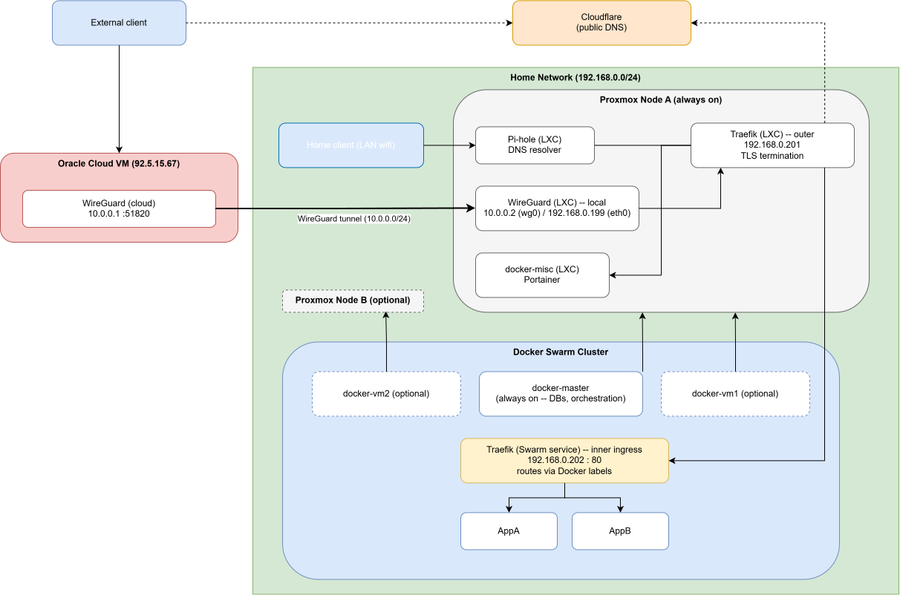

> ⚠️ This is a personal project in progress.

## Tech stack

Docker Swarm · Terraform · Traefik · Pi-hole · Portainer · Wire Guard · Proxmox · Cloudflare · Oracle Cloud · Self-hosted apps

# HomeLab

A self-hosted infrastructure environment to get hands-on depth with the platform/DevOps tooling used in production engineering orgs on my own hardware and offload my main laptop by distributing work on other machines.

| Component           | Purpose                                                                                                                          |
|---------------------|----------------------------------------------------------------------------------------------------------------------------------|
| Docker Swarm        | Orchestration layer for the whole lab — overlay networks, node placement constraints, Swarm-native secrets.                      |
| `network/pihole`    | Network-wide DNS.                                                                                                                |
| `network/traefik`   | Reverse proxy in front of all services, with automated Let's Encrypt certificates via Cloudflare DNS challenge.                  |
| `network/wireguard` | Used to enable remote access into Home Lab.                                                                                      |
| `portainer`         | Web UI for managing the Docker Swarm cluster and containers outside cluster.                                                     |
| `other folders`     | Optionally hosted apps which are part of the delivery platform (packages management, builds, planning) and their configurations. |

## Architecture notes

- There are 2 Proxmox nodes. One of them is always up and hosts required apps: DNS resolver (Pi-hole in LXC container), reverse proxy (Traefik is LXC container), VPN tunnel to access home lab outside local network using Oracle VM (WireGuard in LXC container), `docker-misc` LXC container for lightweight apps outside Docker Swarm (Portainer is hosted here).
- Other apps are deployed on docker VMs which are parts of docker swarm cluster: `docker-master` (main node for orchestration, inner traefik instance for apps in a swarm and DBs), optional `docker-vm1` (hosted on the first proxmox node), optional `docker-vm2` (hosted on the second proxmox node)
- Oracle VM hosts Wire Guard connected to LXC container with wireguard in the local network and forwards all traffic into local network from public Internet. Cloudflare DNS resolver replaces Pi-hole here.

## Status

- **Networking: done.** Core connectivity is stable and in daily use -- Docker Swarm cluster, Pi-hole, Traefik (outer + inner), and the WireGuard tunnel through the Oracle cloud VM all work end-to-end, including remote access from outside the home network.
- **Current focus: package management and CI/CD.** Working on the delivery platform side of the lab -- primarily a self-hosted package registry (Conan in particular, for Chrysalis's C++ dependencies) and a CI/CD setup for building and testing apps on Linux.
- **Not started:** automated monitoring/alerting; backups.